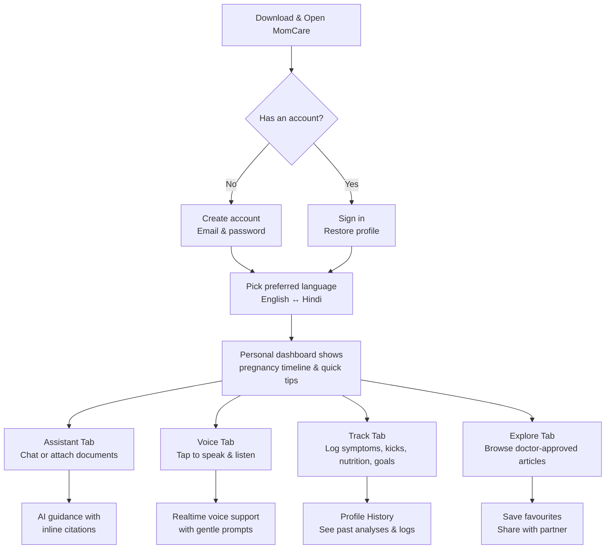
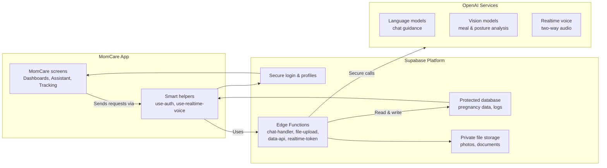

# MomCare Expo

MomCare is an Expo-based prenatal companion that brings evidence-backed guidance, conversational AI, and culturally-resonant support to busy urban mothers. It wraps clinical insight in warmth so a mom juggling checkups, family expectations, and late-night worries always finds a reassuring voice that speaks her language. The app blends Retrieval-Augmented Generation, multimodal inputs, and personalised tracking so proactive prenatal care feels achievable.

Supabase Edge Functions host every piece of server logic, giving us a single secure plane for OpenAI credentials, Row Level Security, and future analytics while the mobile client stays lean. This unified backend keeps validation, compliance, and performance anchored in one place, ensuring the experience stays reliable even as new features roll out.

## System Requirements

- Node.js 18.18 LTS or later (`node --version`)
- npm 10.3 or later (`npm --version`)
- Expo CLI 6.3 or later (`npm install -g expo-cli` and `npx expo --version`)
- Java Development Kit 17 with Android SDK 34 for Android builds; Xcode 15+ for iOS simulation (macOS only)
- Physical device or simulator/emulator with microphone access for voice features
- 64-bit Windows, macOS, or Linux machine with at least 8 GB RAM and 10 GB free disk space

## Getting Started

1. Confirm prerequisites are installed and at the versions above. Install the Expo Go or Dev Client app on any companion devices you plan to test with.
2. Install dependencies from the project root:

    ```bash
    npm install
    ```

3. Configure environment variables (via `.env`, Expo secrets, or CI variables):

  - `EXPO_PUBLIC_SUPABASE_URL`
  - `EXPO_PUBLIC_SUPABASE_KEY`
  - `SUPABASE_SERVICE_ROLE_KEY`
  - `OPENAI_API_KEY`
  - Optional: `DATABASE_URL` for local Supabase CLI tasks.

4. Start the Expo development server:

    ```bash
    npm start
    ```

  Press `i` for iOS simulator, `a` for Android emulator, or scan the QR code with the Expo client.

5. Deploy or update Edge Functions with the Supabase CLI whenever backend code changes.

## Working Capabilities

- Authentication: email/password signup, password reset links, session persistence, and automatic profile bootstrap with language preference loading.
- Assistant (text): streaming chat in Hindi and English, inline citations, document-aware memory, and attachment ingestion via Edge Functions.
- Assistant (voice): realtime WebRTC conversations backed by the OpenAI Realtime API, on-device tool resolution, and dynamic prompts informed by user logs.
- Tracking: interactive screens for symptoms, fetal kicks, nutrition logs, personal goals, and priority-based health alerts, all persisted through Supabase Edge Functions.
- Image analysis: GPT-4o-powered meal and posture evaluation with automatic nutrition entries and history surfaced in the profile screen.
- Discovery: Explore tab delivering curated resources with search, filters, bookmarking, and sharing flows tailored for prenatal guidance.
- Platform plumbing: unified `lib/supabase-api.ts` client mediating every network request plus background job execution via Supabase Edge Functions.

## User Journey At A Glance

The flow below highlights what a typical mom experiences inside the app, from sign-in to ongoing support.



### What the user sees

- **Clear guidance**: Each screen focuses on one job—assist, track, explore, or review progress.
- **Always available**: Chat and voice assistants respond in either Hindi or English and explain the source of information.
- **Celebrates progress**: Profile history surfaces meal analyses, posture insights, and pregnancy milestones to keep motivation high.

## System Architecture Snapshot

This diagram explains how the mobile app, Supabase services, and OpenAI work together without requiring coding knowledge.



### Why this setup works

- **Privacy first**: Sensitive OpenAI keys and health data stay inside Supabase; the phone never stores them.
- **One gateway**: Edge Functions act as the single gatekeeper, so every feature follows the same rules and security checks.
- **Performance & scale**: Supabase handles authentication, storage, and database logic, while OpenAI delivers chat, voice, and vision intelligence.

## Architecture Overview

- **Expo Client**: Expo Router, TypeScript, theming in `MotherhoodTheme`, AsyncStorage session handling.
- **Auth & Data**: Supabase Postgres with pgvector plus strict Row Level Security across user tables.
- **Edge Functions**:
  - `chat-handler` — text assistant with memory and inline citations.
  - `chat-attachments` — document ingestion, summarisation, and embeddings.
  - `data-api` — CRUD gateway for tracking modules and profile data.
  - `file-upload` — GPT-4o vision pipeline with nutrition logging.
  - `realtime-token` — OpenAI Realtime session broker for WebRTC voice.
  - `background-job-worker` — executes queued jobs and alerts.
- **AI Providers**: OpenAI GPT-4o/GPT-4o-mini, text-embedding-3-small, Whisper transcription, Realtime streaming.
- **Hooks**: `use-auth`, `use-chat-retry`, `use-image-analysis`, `use-realtime-voice`.

## Directory Highlights

```
app/                    Expo Router screens (tabs, auth, onboarding)
components/             Reusable UI and assistant modules
hooks/                  Client-side state and data hooks
lib/supabase-api.ts     Unified Edge Function client
supabase/functions/     Edge Function source
docs/                   Feature status and implementation notes
```

## Useful Scripts

- `npm start` – Expo development server.
- `npm run android` / `npm run ios` – Build and launch on a device or simulator.
- `npm run lint` – Lint the project via ESLint.
- `npm run reset-project` – Clear caches for stubborn Expo builds.

## Development Notes

- Voice features require a device (or simulator with a microphone) and microphone permissions.
- Attachments are stored in the `conversation-files` bucket; align storage policies between dev and prod.
- Image analysis expects files under roughly 5 MB and persists results to `image_analysis_results` (plus `nutrition_logs` for meals).
- The assistant relies on `conversation_documents` and `document_embeddings`; run migrations before exercising document uploads.

## Roadmap

- Analytics dashboards and observability for Edge Function usage.
- Push notifications for reminders and clinician escalations.
- Broader multilingual support beyond Hindi/English (additional TTS voices).
- Automated integration tests for Edge Functions and tracking workflows.

For status snapshots and deeper implementation details, see `docs/feature_status_docs/FEATURE_STATUS.md` and `docs/feature_status_docs/QUICK_REFERENCE.md`.

## Future Enhancements

- Deeper clinician collaboration features with secure message review and escalation loops.
- Adaptive care plans that adjust prompts and reminders based on trimester milestones.
- Offline-first journaling so moms can capture insights without a signal and sync later.
- Peer support moments powered by moderated community spotlights and shared victories.
