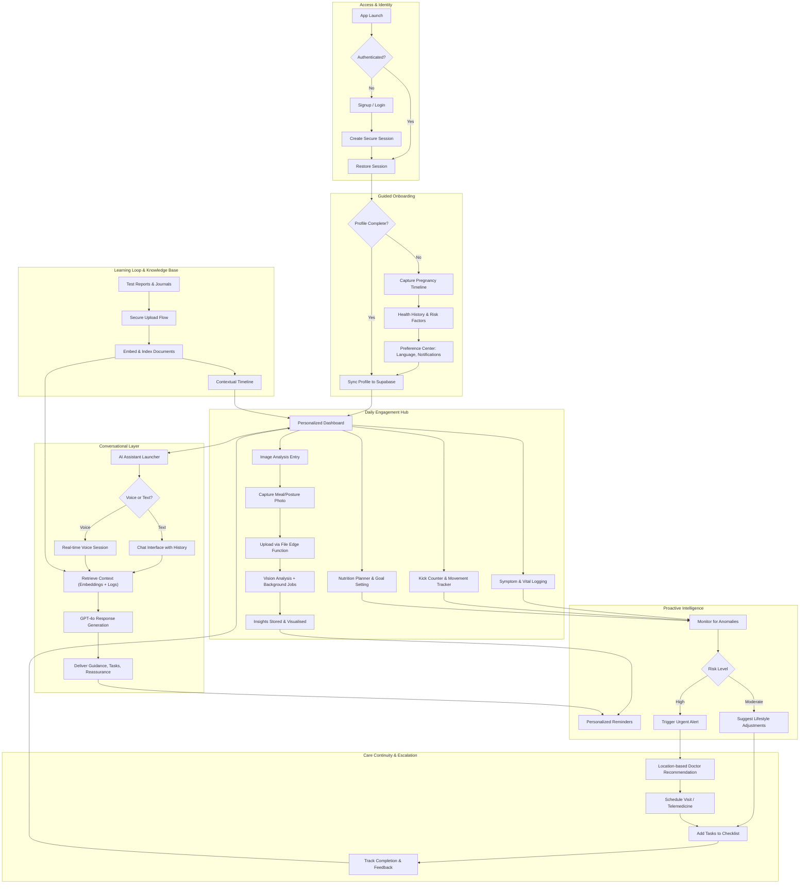

# MomCare Expo 👋

MomCare addresses the gaps urban Indian mothers face in getting timely, culturally relevant prenatal guidance by combining clinically vetted content, multilingual support, and AI-driven personalization so that busy families receive evidence-based reminders, risk alerts, and wellness tips without relying solely on fragmented online advice.

## Project Progress & Features

- **Phase 1 – MVP (Complete):** Supabase infrastructure, secure authentication, chat and voice assistants, memory/RAG pipeline, dashboard, and five tracking screens (symptoms, kicks, nutrition, goals, alerts).
- **Phase 2 – Advanced Features (Complete):** GPT-4o vision image analysis, background job worker, meal logging, posture assessment, image picker, and history surfacing in profile.
- **Phase 3 – Discovery (Complete):** Explore hub with curated resources, search and filtering, bookmarking, and sharing flows.
- **Phase 4 – Edge Functions Migration (partially complete):** Unified `lib/supabase-api.ts`, Supabase Edge Functions (`chat-handler`, `voice-handler`, `data-api`, `file-upload`), and decommissioned legacy AI utilities.

## Technical Overview

### User Flow Diagram



### System Architecture Diagram

```mermaid
flowchart LR
   subgraph Client_LAYER
      Client["Expo Mobile App<br/>- React Native + Expo Router<br/>- Platforms: Android, iOS, web"]
   end

   subgraph Supabase_PLATFORM
      Auth["Supabase Auth<br/>- Email/Password, magic links<br/>- Session stored in SecureStore"]
      Database[("Postgres + pgvector<br/>- Conversations, tracking data, embeddings<br/>- Row Level Security enforced")]
      Storage[["Supabase Storage<br/>- Buckets: avatars, meal-images, posture-images<br/>- PENDING: Edge Function upload flow refresh"]]
      Worker["Background Job Queue<br/>- Supabase scheduled functions<br/>- PENDING: Vision job dispatcher wiring"]
   end

   subgraph Edge_Functions_Deployed
      ChatEF["chat-handler<br/>LIVE: Chat orchestration, memory, RAG"]
      VoiceEF["voice-handler<br/>LIVE: Speech-to-text and text-to-speech"]
      DataEF["data-api<br/>LIVE: CRUD for symptoms, kicks, goals, alerts, profile"]
      FileEF["file-upload<br/>PENDING: Image analysis + storage integration"]
   end

   Client -->|Supabase JS SDK| Auth
   Client -->|Calls| ChatEF
   Client -->|Calls| VoiceEF
   Client -->|Calls| DataEF
   Client -->|Calls (to-be rebound)| FileEF

   ChatEF -->|Context fetch| Database
   ChatEF -->|Embedding writes| Database
   ChatEF -->|AI requests| OpenAI["OpenAI GPT-4o Mini"]

   VoiceEF -->|Transcribe or synthesize| OpenAI

   DataEF -->|CRUD| Database

   FileEF -->|Store files| Storage
   FileEF -->|Queue analysis jobs| Worker
   FileEF -->|Vision request (todo)| OpenAIVision["OpenAI GPT-4o Vision<br/>BLOCKED: Awaiting image pipeline"]

   Worker -->|Write results| Database
   Worker -->|Notify client (todo)| PushService["Push or Realtime Notifications<br/>BLOCKED: No implementation"]

   Auth --> Database
   Database --> Policies[RLS Policies]

   subgraph Observability
      Logs["Edge Function Logs<br/>- Supabase dashboard today<br/>- Datadog integration planned"]
   end

   ChatEF --> Logs
   VoiceEF --> Logs
   DataEF --> Logs
   FileEF --> Logs
```

Legend: LIVE = implemented, PENDING = work in progress, BLOCKED = dependency outstanding

Current gaps: the file-upload pipeline, background job dispatcher, and push/realtime notifications are scaffolded but inactive, so image insights and automated follow-up alerts remain unavailable until the new integrations are completed.

### Upcoming Enhancements

- Personalized real-time voice coaching that adapts prompts and tone to the user's trimester, symptoms, and language preferences.
- Secure upload of medical test reports with embeddings for context-aware conversations between the user and AI assistant.
- Expanded Edge Function support for ingesting clinical documents and aligning AI responses with physician-approved guidelines.

## Business Opportunity

MomCare can evolve into a sustainable digital maternal-care platform by layering premium guidance on top of the core companion experience, giving expectant parents confidence and clinicians actionable touchpoints.

- Personalized care plans tuned to specific symptoms, medical history, and wellness goals.
- Location-aware doctor and clinic recommendations with referral or lead fees.
- Optional telemedicine sessions, partner bundles with hospitals, and sponsored wellness programs.
