# MomCare Expo 👋

MomCare addresses the gaps urban Indian mothers face in getting timely, culturally relevant prenatal guidance by combining clinically vetted content, multilingual support, and AI-driven personalization so that busy families receive evidence-based reminders, risk alerts, and wellness tips without relying solely on fragmented online advice.

## Project Progress & Features

- **Phase 1 – MVP (Complete):** Supabase infrastructure, secure authentication, chat and voice assistants, memory/RAG pipeline, dashboard, and five tracking screens (symptoms, kicks, nutrition, goals, alerts).
- **Phase 2 – Advanced Features (Complete):** GPT-4o vision image analysis, background job worker, meal logging, posture assessment, image picker, and history surfacing in profile.
- **Phase 3 – Discovery (Complete):** Explore hub with curated resources, search and filtering, bookmarking, and sharing flows.
- **Phase 4 – Edge Functions Migration (partially complete):** Unified `lib/supabase-api.ts`, Supabase Edge Functions (`chat-handler`, `voice-handler`, `data-api`, `file-upload`), and decommissioned legacy AI utilities.

## Technical Overview

### User Flow Diagram

```mermaid
flowchart TD
    A["App Launch — LIVE"] --> B{Authenticated?}
    B -- No --> C["Sign Up / Login — LIVE"]
    C --> D["Profile Setup — LIVE"]
    B -- Yes --> D
    D --> E["Personalized Dashboard — LIVE"]
    E --> F["Tracking Modules — LIVE"]
    E --> G["AI Assistant — LIVE"]
    G --> H["chat-handler Edge Function — LIVE"]
    H --> I["Contextual Response — LIVE"]
    E --> J["Image Upload Flow — PENDING"]
    J --> K["file-upload Edge Function — PENDING"]
    K --> L["Background Vision Jobs — BLOCKED"]
    L --> M["Automated Alerts & Doctor Escalation — BLOCKED"]
```

### System Architecture Diagram

```mermaid
flowchart LR
    Client["Expo App — LIVE"] --> Auth["Supabase Auth — LIVE"]
    Client --> DataEF["data-api Edge Function — LIVE"]
    Client --> ChatEF["chat-handler Edge Function — LIVE"]
    Client --> VoiceEF["voice-handler Edge Function — LIVE"]
    Client --> FileEF["file-upload Edge Function — PENDING"]
    DataEF --> DB["Postgres + pgvector — LIVE"]
    ChatEF --> DB
    ChatEF --> OpenAI["OpenAI GPT-4o Mini — LIVE"]
    VoiceEF --> OpenAI
    FileEF --> Storage["Supabase Storage — PENDING"]
    FileEF --> Jobs["Background Jobs Queue — BLOCKED"]
    Jobs --> Alerts["Realtime Notifications — BLOCKED"]
    DB --> Policies["RLS Policies — LIVE"]
```

Legend: LIVE = implemented • PENDING = in progress • BLOCKED = not yet available

Current gaps: Image uploads, document embeddings, and the background job dispatcher are not wired up, so automated insights and alerts will remain inactive until those pipelines ship.

### Upcoming Enhancements

- Personalized real-time voice coaching that adapts prompts and tone to the user's trimester, symptoms, and language preferences.
- Secure upload of medical test reports with embeddings for context-aware conversations between the user and AI assistant.
- Expanded Edge Function support for ingesting clinical documents and aligning AI responses with physician-approved guidelines.

## Business Opportunity

MomCare can evolve into a sustainable digital maternal-care platform by layering premium guidance on top of the core companion experience, giving expectant parents confidence and clinicians actionable touchpoints.

- Personalized care plans tuned to specific symptoms, medical history, and wellness goals.
- Location-aware doctor and clinic recommendations with referral or lead fees.
- Optional telemedicine sessions, partner bundles with hospitals, and sponsored wellness programs.
